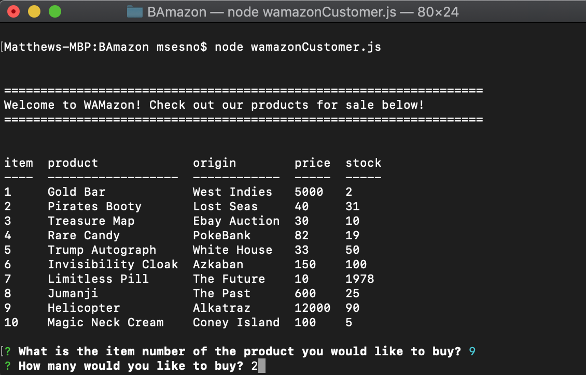
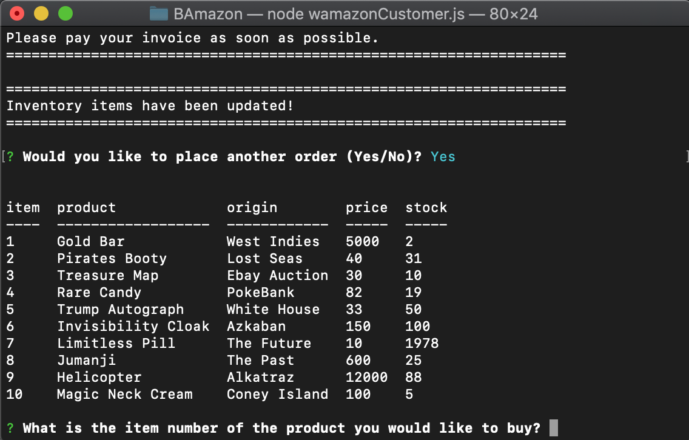
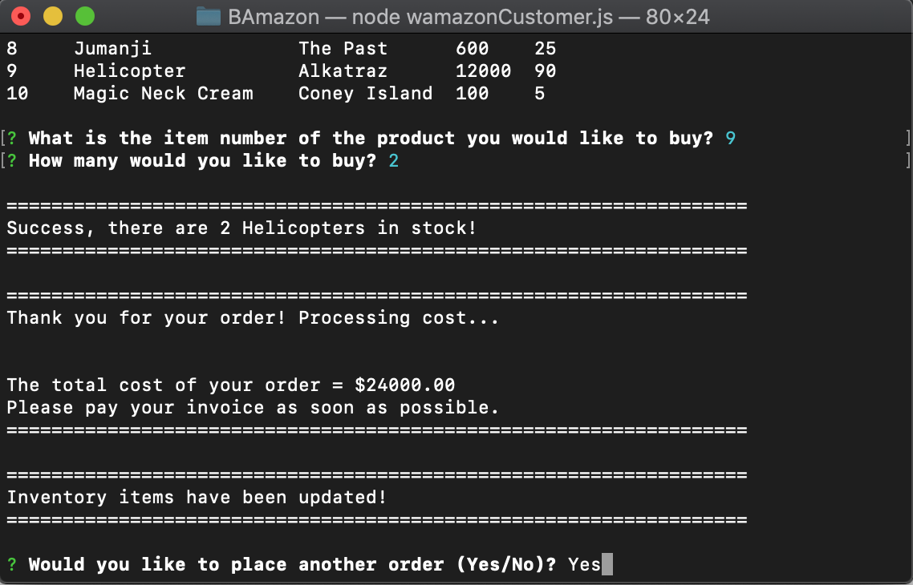

# WAMazon Bot
WAMazon bot is an online store command line program that uses node.js and npm plugins with mysql local to save auction item quantity. NPM plugins include inquirer, mysql, and console.table for command line UI.
 
Setup is a little tricky, steps outlined below. 

<br><br>

## Setup
- Navigate in your console to desired directory in console 
- run ```git clone https://github.com/msesno/wamazon``` to clone repo
- run ```npm i``` to install your node.js dependencies 
- enter mysql password in ```wamazonCustomer.js``` file & save
- open ```wamazonSchema.sql``` in mysql workbench
- select all, run database
- open command line and type....
```
node wamazonCustomer.js
```

Congrats, you should now be running the program and see the items listed! 

<br><br>

## Using WAMazon
Once open you should follow instructions 

- NOTE: on buy more items, make sure Yes/No answer is case sensitive

<br><br>

## Screenshots
<br>
<br>
<br>